# Check2Go screen exports

Source: [Check2Go / Screens in Figma](https://www.figma.com/design/FVVplMUExRWDAY1npMxRmj/Check2Go?node-id=1-26200).

Exported on 2026-09-13 using the connected Figma module. All 49 top-level screen frames on the Screens page are included, in Figma layer order. Original names, configured image formats and export resolutions are preserved. Similar names represent separate frames or states; node IDs make filenames unique. Standalone annotation text outside screen frames is not exported.

These are static visual snapshots. The editable design remains in Figma; this folder is not a `.fig` backup. Existing historical variants are included without selecting a preferred implementation.

See [manifest.json](manifest.json) for original frame dimensions and individual source links.

## Screen catalog

| Screen | Figma node | Image |
| --- | --- | --- |
| Main screen-sheet trips | [1:27854](https://www.figma.com/design/FVVplMUExRWDAY1npMxRmj/Check2Go?node-id=1-27854) | [View](1-27854.png) |
| Main screen-sheet trips | [1:27885](https://www.figma.com/design/FVVplMUExRWDAY1npMxRmj/Check2Go?node-id=1-27885) | [View](1-27885.jpeg) |
| Main screen-sheet trips | [1:27916](https://www.figma.com/design/FVVplMUExRWDAY1npMxRmj/Check2Go?node-id=1-27916) | [View](1-27916.jpeg) |
| Use hecklist-v1 | [1:27947](https://www.figma.com/design/FVVplMUExRWDAY1npMxRmj/Check2Go?node-id=1-27947) | [View](1-27947.png) |
| Use hecklist-v1 | [1:27985](https://www.figma.com/design/FVVplMUExRWDAY1npMxRmj/Check2Go?node-id=1-27985) | [View](1-27985.png) |
| Share checklist | [1:28023](https://www.figma.com/design/FVVplMUExRWDAY1npMxRmj/Check2Go?node-id=1-28023) | [View](1-28023.png) |
| Edit checklist | [1:28059](https://www.figma.com/design/FVVplMUExRWDAY1npMxRmj/Check2Go?node-id=1-28059) | [View](1-28059.png) |
| Create checklist | [1:28126](https://www.figma.com/design/FVVplMUExRWDAY1npMxRmj/Check2Go?node-id=1-28126) | [View](1-28126.png) |
| Add a traveler | [1:28193](https://www.figma.com/design/FVVplMUExRWDAY1npMxRmj/Check2Go?node-id=1-28193) | [View](1-28193.png) |
| Replace photo | [1:28224](https://www.figma.com/design/FVVplMUExRWDAY1npMxRmj/Check2Go?node-id=1-28224) | [View](1-28224.png) |
| My travelers | [1:28280](https://www.figma.com/design/FVVplMUExRWDAY1npMxRmj/Check2Go?node-id=1-28280) | [View](1-28280.png) |
| My travelers | [1:28289](https://www.figma.com/design/FVVplMUExRWDAY1npMxRmj/Check2Go?node-id=1-28289) | [View](1-28289.png) |
| Duplicate checklist | [1:28318](https://www.figma.com/design/FVVplMUExRWDAY1npMxRmj/Check2Go?node-id=1-28318) | [View](1-28318.png) |
| Replace photo | [1:28396](https://www.figma.com/design/FVVplMUExRWDAY1npMxRmj/Check2Go?node-id=1-28396) | [View](1-28396.png) |
| Main screen-grid trips | [1:28448](https://www.figma.com/design/FVVplMUExRWDAY1npMxRmj/Check2Go?node-id=1-28448) | [View](1-28448.png) |
| Main screen-grid trips | [1:28479](https://www.figma.com/design/FVVplMUExRWDAY1npMxRmj/Check2Go?node-id=1-28479) | [View](1-28479.png) |
| Main screen_no trips | [1:28510](https://www.figma.com/design/FVVplMUExRWDAY1npMxRmj/Check2Go?node-id=1-28510) | [View](1-28510.png) |
| Main screen_no trips | [1:28553](https://www.figma.com/design/FVVplMUExRWDAY1npMxRmj/Check2Go?node-id=1-28553) | [View](1-28553.png) |
| All checklists | [1:28596](https://www.figma.com/design/FVVplMUExRWDAY1npMxRmj/Check2Go?node-id=1-28596) | [View](1-28596.png) |
| All checklists | [1:28613](https://www.figma.com/design/FVVplMUExRWDAY1npMxRmj/Check2Go?node-id=1-28613) | [View](1-28613.png) |
| Main screen_Calendar settings | [1:28630](https://www.figma.com/design/FVVplMUExRWDAY1npMxRmj/Check2Go?node-id=1-28630) | [View](1-28630.png) |
| Add a trip-Step 3 | [1:28694](https://www.figma.com/design/FVVplMUExRWDAY1npMxRmj/Check2Go?node-id=1-28694) | [View](1-28694.png) |
| Add a trip-Step 5 | [1:28739](https://www.figma.com/design/FVVplMUExRWDAY1npMxRmj/Check2Go?node-id=1-28739) | [View](1-28739.png) |
| Add a trip-Step 2 | [1:28835](https://www.figma.com/design/FVVplMUExRWDAY1npMxRmj/Check2Go?node-id=1-28835) | [View](1-28835.png) |
| Add a trip-Step 4 | [1:28880](https://www.figma.com/design/FVVplMUExRWDAY1npMxRmj/Check2Go?node-id=1-28880) | [View](1-28880.png) |
| Add a trip-Step 6 | [1:28925](https://www.figma.com/design/FVVplMUExRWDAY1npMxRmj/Check2Go?node-id=1-28925) | [View](1-28925.png) |
| Add a trip-Step 1 | [1:28970](https://www.figma.com/design/FVVplMUExRWDAY1npMxRmj/Check2Go?node-id=1-28970) | [View](1-28970.png) |
| iPhone 8 - 27 | [1:29012](https://www.figma.com/design/FVVplMUExRWDAY1npMxRmj/Check2Go?node-id=1-29012) | [View](1-29012.png) |
| popup-calendar | [1:29068](https://www.figma.com/design/FVVplMUExRWDAY1npMxRmj/Check2Go?node-id=1-29068) | [View](1-29068.png) |
| Set deadline | [1:29086](https://www.figma.com/design/FVVplMUExRWDAY1npMxRmj/Check2Go?node-id=1-29086) | [View](1-29086.png) |
| popup-calendar | [1:29104](https://www.figma.com/design/FVVplMUExRWDAY1npMxRmj/Check2Go?node-id=1-29104) | [View](1-29104.png) |
| Set deadline | [1:29123](https://www.figma.com/design/FVVplMUExRWDAY1npMxRmj/Check2Go?node-id=1-29123) | [View](1-29123.png) |
| popup-calendar | [1:29142](https://www.figma.com/design/FVVplMUExRWDAY1npMxRmj/Check2Go?node-id=1-29142) | [View](1-29142.png) |
| Set deadline | [1:29160](https://www.figma.com/design/FVVplMUExRWDAY1npMxRmj/Check2Go?node-id=1-29160) | [View](1-29160.png) |
| Add a trip | [1:29178](https://www.figma.com/design/FVVplMUExRWDAY1npMxRmj/Check2Go?node-id=1-29178) | [View](1-29178.png) |
| Add a trip | [1:29204](https://www.figma.com/design/FVVplMUExRWDAY1npMxRmj/Check2Go?node-id=1-29204) | [View](1-29204.png) |
| Add a trip | [1:29236](https://www.figma.com/design/FVVplMUExRWDAY1npMxRmj/Check2Go?node-id=1-29236) | [View](1-29236.png) |
| Add a trip | [1:29269](https://www.figma.com/design/FVVplMUExRWDAY1npMxRmj/Check2Go?node-id=1-29269) | [View](1-29269.png) |
| Add a trip | [1:29302](https://www.figma.com/design/FVVplMUExRWDAY1npMxRmj/Check2Go?node-id=1-29302) | [View](1-29302.png) |
| Add a trip | [1:29314](https://www.figma.com/design/FVVplMUExRWDAY1npMxRmj/Check2Go?node-id=1-29314) | [View](1-29314.png) |
| Add a trip | [1:29326](https://www.figma.com/design/FVVplMUExRWDAY1npMxRmj/Check2Go?node-id=1-29326) | [View](1-29326.png) |
| Main screen-sheet trips | [1:29340](https://www.figma.com/design/FVVplMUExRWDAY1npMxRmj/Check2Go?node-id=1-29340) | [View](1-29340.png) |
| Main screen-sheet trips | [1:29482](https://www.figma.com/design/FVVplMUExRWDAY1npMxRmj/Check2Go?node-id=1-29482) | [View](1-29482.png) |
| Main screen-sheet trips | [1:29624](https://www.figma.com/design/FVVplMUExRWDAY1npMxRmj/Check2Go?node-id=1-29624) | [View](1-29624.png) |
| Main screen-sheet trips | [1:29766](https://www.figma.com/design/FVVplMUExRWDAY1npMxRmj/Check2Go?node-id=1-29766) | [View](1-29766.png) |
| Use hecklist-Take on a trip | [1:29908](https://www.figma.com/design/FVVplMUExRWDAY1npMxRmj/Check2Go?node-id=1-29908) | [View](1-29908.png) |
| Use hecklist-Transfer | [1:29943](https://www.figma.com/design/FVVplMUExRWDAY1npMxRmj/Check2Go?node-id=1-29943) | [View](1-29943.png) |
| Use hecklist-Accommodation | [1:29981](https://www.figma.com/design/FVVplMUExRWDAY1npMxRmj/Check2Go?node-id=1-29981) | [View](1-29981.png) |
| Create checklist | [1:30013](https://www.figma.com/design/FVVplMUExRWDAY1npMxRmj/Check2Go?node-id=1-30013) | [View](1-30013.png) |

## Previews

### Main screen-sheet trips (1:27854)

[Open in Figma](https://www.figma.com/design/FVVplMUExRWDAY1npMxRmj/Check2Go?node-id=1-27854)

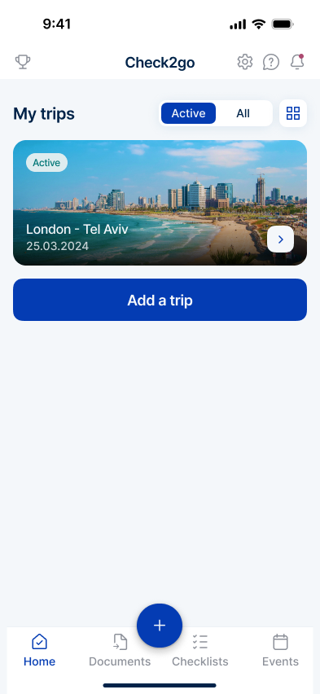

### Main screen-sheet trips (1:27885)

[Open in Figma](https://www.figma.com/design/FVVplMUExRWDAY1npMxRmj/Check2Go?node-id=1-27885)

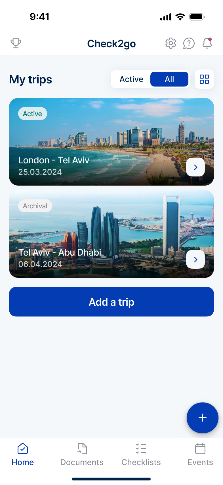

### Main screen-sheet trips (1:27916)

[Open in Figma](https://www.figma.com/design/FVVplMUExRWDAY1npMxRmj/Check2Go?node-id=1-27916)

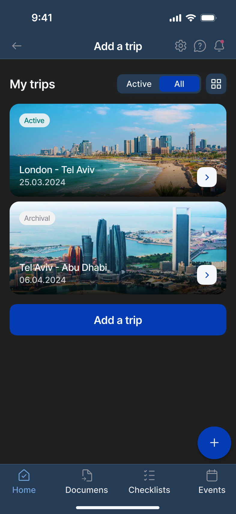

### Use hecklist-v1 (1:27947)

[Open in Figma](https://www.figma.com/design/FVVplMUExRWDAY1npMxRmj/Check2Go?node-id=1-27947)

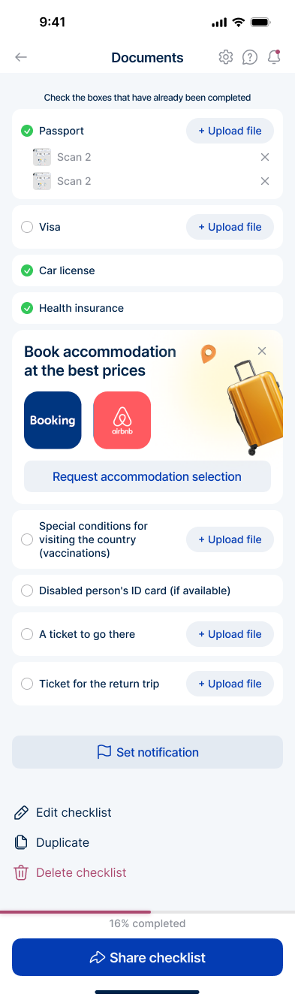

### Use hecklist-v1 (1:27985)

[Open in Figma](https://www.figma.com/design/FVVplMUExRWDAY1npMxRmj/Check2Go?node-id=1-27985)

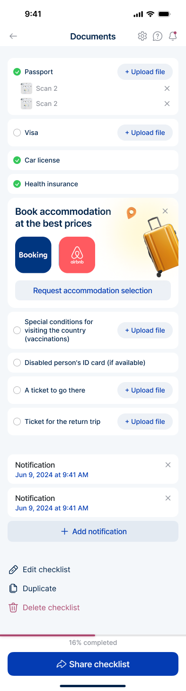

### Share checklist (1:28023)

[Open in Figma](https://www.figma.com/design/FVVplMUExRWDAY1npMxRmj/Check2Go?node-id=1-28023)

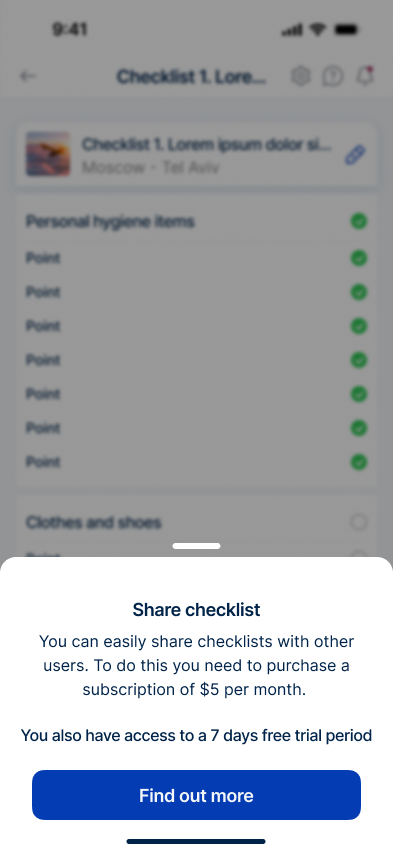

### Edit checklist (1:28059)

[Open in Figma](https://www.figma.com/design/FVVplMUExRWDAY1npMxRmj/Check2Go?node-id=1-28059)

### Create checklist (1:28126)

[Open in Figma](https://www.figma.com/design/FVVplMUExRWDAY1npMxRmj/Check2Go?node-id=1-28126)

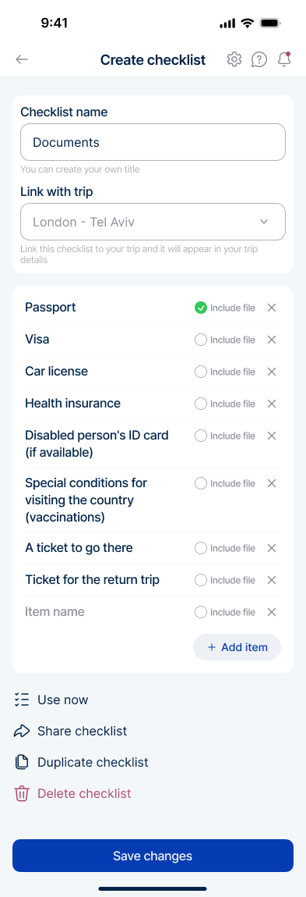

### Add a traveler (1:28193)

[Open in Figma](https://www.figma.com/design/FVVplMUExRWDAY1npMxRmj/Check2Go?node-id=1-28193)

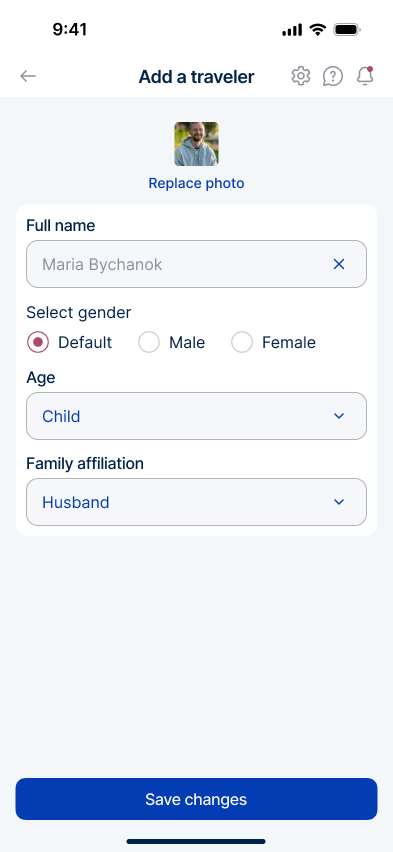

### Replace photo (1:28224)

[Open in Figma](https://www.figma.com/design/FVVplMUExRWDAY1npMxRmj/Check2Go?node-id=1-28224)

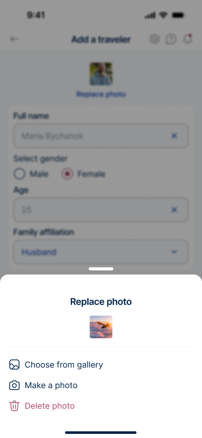

### My travelers (1:28280)

[Open in Figma](https://www.figma.com/design/FVVplMUExRWDAY1npMxRmj/Check2Go?node-id=1-28280)

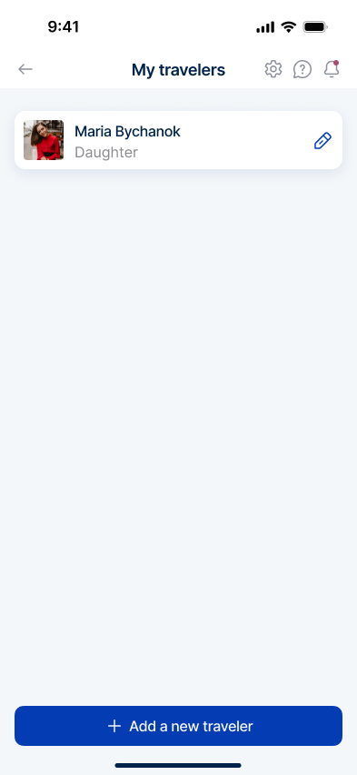

### My travelers (1:28289)

[Open in Figma](https://www.figma.com/design/FVVplMUExRWDAY1npMxRmj/Check2Go?node-id=1-28289)

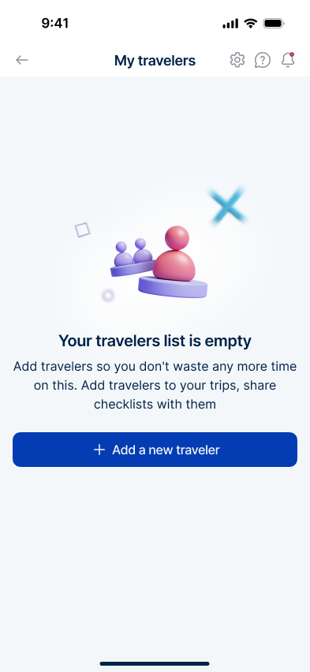

### Duplicate checklist (1:28318)

[Open in Figma](https://www.figma.com/design/FVVplMUExRWDAY1npMxRmj/Check2Go?node-id=1-28318)

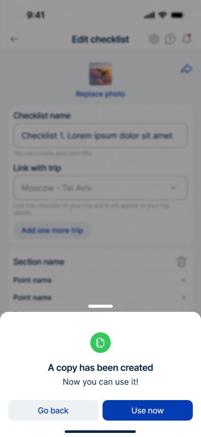

### Replace photo (1:28396)

[Open in Figma](https://www.figma.com/design/FVVplMUExRWDAY1npMxRmj/Check2Go?node-id=1-28396)

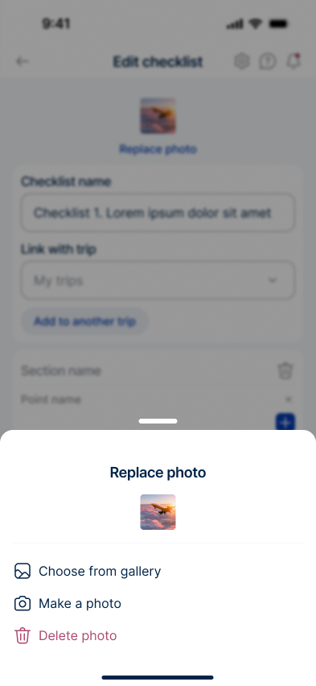

### Main screen-grid trips (1:28448)

[Open in Figma](https://www.figma.com/design/FVVplMUExRWDAY1npMxRmj/Check2Go?node-id=1-28448)

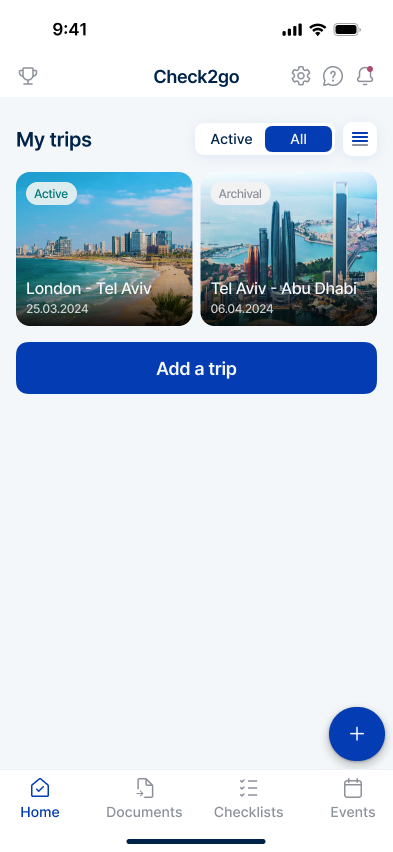

### Main screen-grid trips (1:28479)

[Open in Figma](https://www.figma.com/design/FVVplMUExRWDAY1npMxRmj/Check2Go?node-id=1-28479)

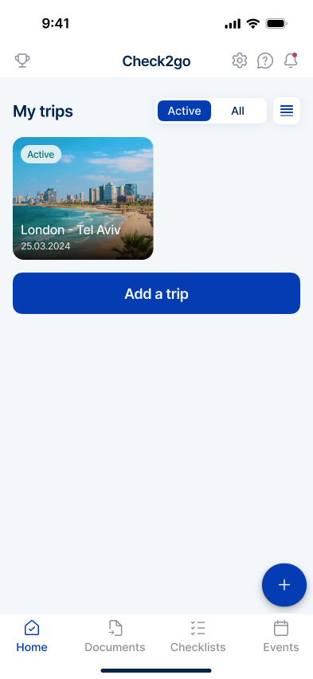

### Main screen_no trips (1:28510)

[Open in Figma](https://www.figma.com/design/FVVplMUExRWDAY1npMxRmj/Check2Go?node-id=1-28510)

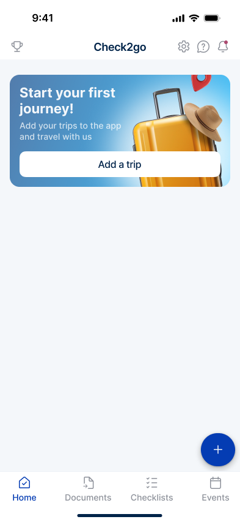

### Main screen_no trips (1:28553)

[Open in Figma](https://www.figma.com/design/FVVplMUExRWDAY1npMxRmj/Check2Go?node-id=1-28553)

### All checklists (1:28596)

[Open in Figma](https://www.figma.com/design/FVVplMUExRWDAY1npMxRmj/Check2Go?node-id=1-28596)

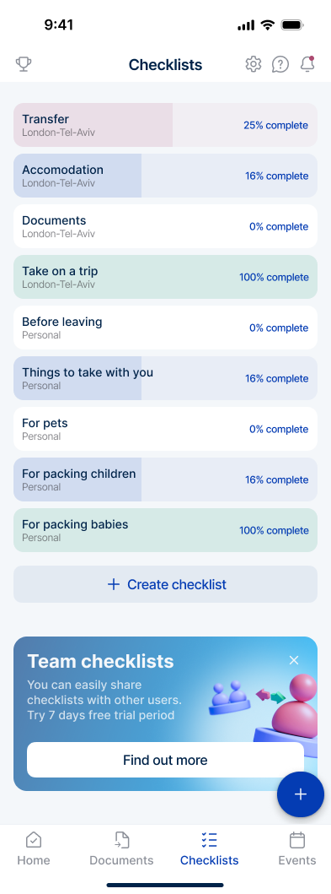

### All checklists (1:28613)

[Open in Figma](https://www.figma.com/design/FVVplMUExRWDAY1npMxRmj/Check2Go?node-id=1-28613)

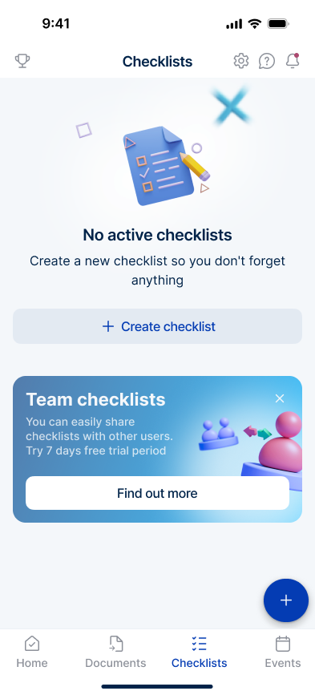

### Main screen_Calendar settings (1:28630)

[Open in Figma](https://www.figma.com/design/FVVplMUExRWDAY1npMxRmj/Check2Go?node-id=1-28630)

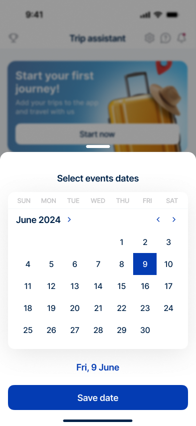

### Add a trip-Step 3 (1:28694)

[Open in Figma](https://www.figma.com/design/FVVplMUExRWDAY1npMxRmj/Check2Go?node-id=1-28694)

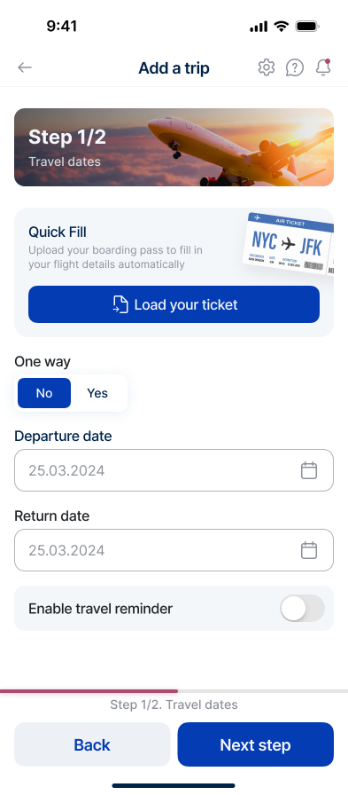

### Add a trip-Step 5 (1:28739)

[Open in Figma](https://www.figma.com/design/FVVplMUExRWDAY1npMxRmj/Check2Go?node-id=1-28739)

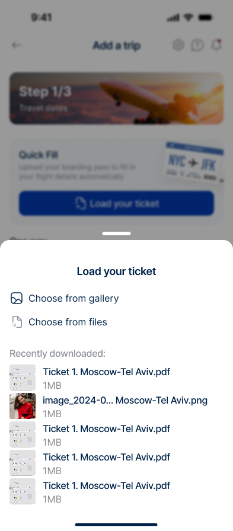

### Add a trip-Step 2 (1:28835)

[Open in Figma](https://www.figma.com/design/FVVplMUExRWDAY1npMxRmj/Check2Go?node-id=1-28835)

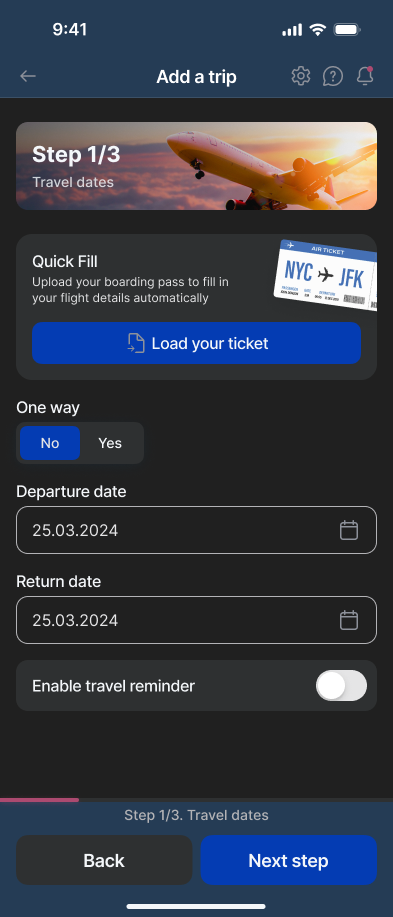

### Add a trip-Step 4 (1:28880)

[Open in Figma](https://www.figma.com/design/FVVplMUExRWDAY1npMxRmj/Check2Go?node-id=1-28880)

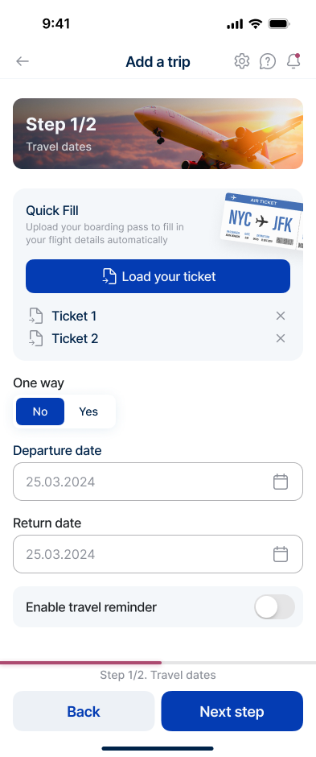

### Add a trip-Step 6 (1:28925)

[Open in Figma](https://www.figma.com/design/FVVplMUExRWDAY1npMxRmj/Check2Go?node-id=1-28925)

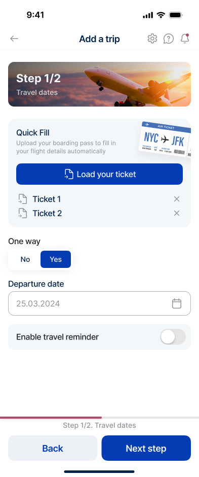

### Add a trip-Step 1 (1:28970)

[Open in Figma](https://www.figma.com/design/FVVplMUExRWDAY1npMxRmj/Check2Go?node-id=1-28970)

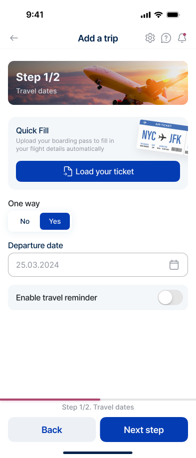

### iPhone 8 - 27 (1:29012)

[Open in Figma](https://www.figma.com/design/FVVplMUExRWDAY1npMxRmj/Check2Go?node-id=1-29012)

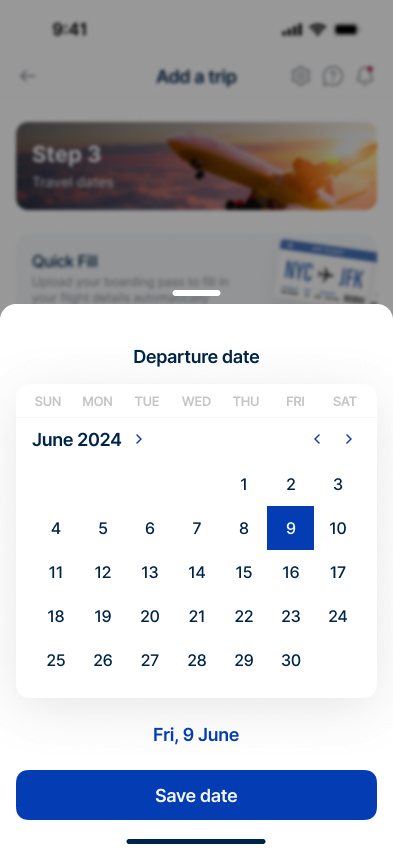

### popup-calendar (1:29068)

[Open in Figma](https://www.figma.com/design/FVVplMUExRWDAY1npMxRmj/Check2Go?node-id=1-29068)

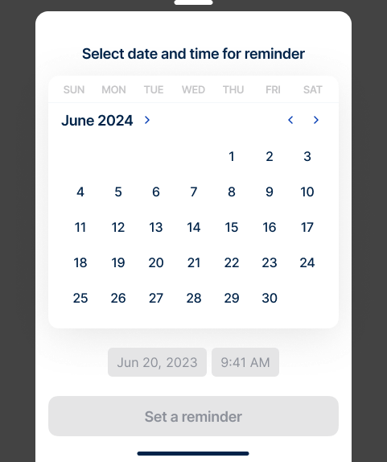

### Set deadline (1:29086)

[Open in Figma](https://www.figma.com/design/FVVplMUExRWDAY1npMxRmj/Check2Go?node-id=1-29086)

### popup-calendar (1:29104)

[Open in Figma](https://www.figma.com/design/FVVplMUExRWDAY1npMxRmj/Check2Go?node-id=1-29104)

### Set deadline (1:29123)

[Open in Figma](https://www.figma.com/design/FVVplMUExRWDAY1npMxRmj/Check2Go?node-id=1-29123)

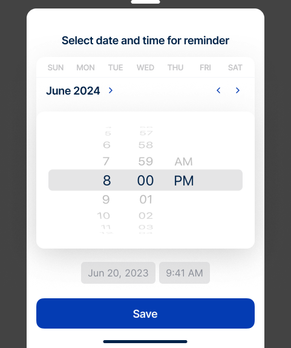

### popup-calendar (1:29142)

[Open in Figma](https://www.figma.com/design/FVVplMUExRWDAY1npMxRmj/Check2Go?node-id=1-29142)

### Set deadline (1:29160)

[Open in Figma](https://www.figma.com/design/FVVplMUExRWDAY1npMxRmj/Check2Go?node-id=1-29160)

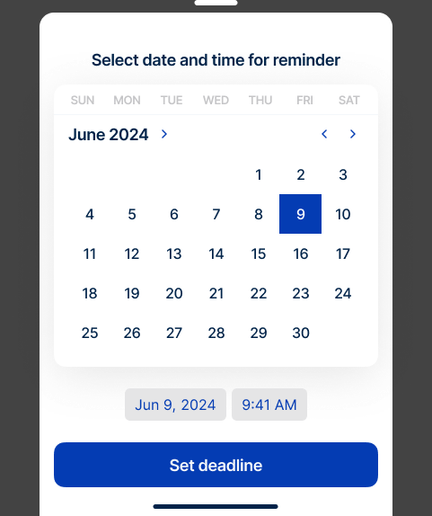

### Add a trip (1:29178)

[Open in Figma](https://www.figma.com/design/FVVplMUExRWDAY1npMxRmj/Check2Go?node-id=1-29178)

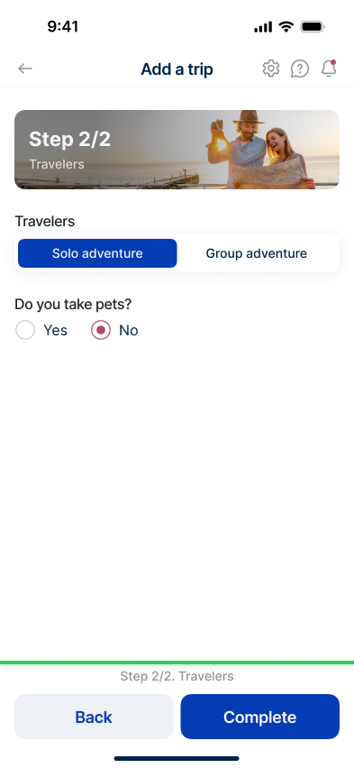

### Add a trip (1:29204)

[Open in Figma](https://www.figma.com/design/FVVplMUExRWDAY1npMxRmj/Check2Go?node-id=1-29204)

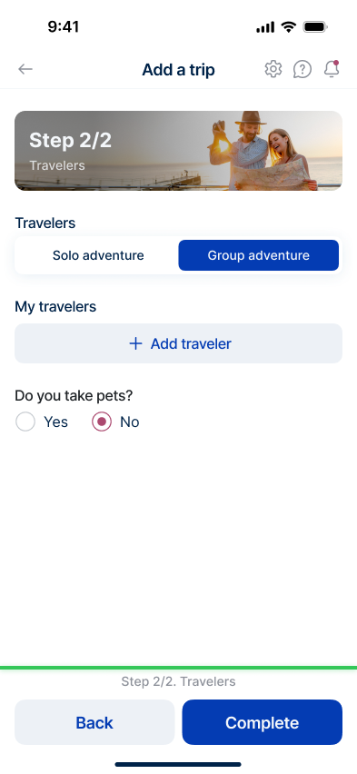

### Add a trip (1:29236)

[Open in Figma](https://www.figma.com/design/FVVplMUExRWDAY1npMxRmj/Check2Go?node-id=1-29236)

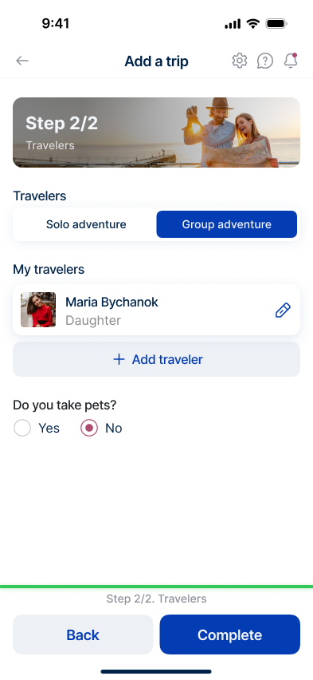

### Add a trip (1:29269)

[Open in Figma](https://www.figma.com/design/FVVplMUExRWDAY1npMxRmj/Check2Go?node-id=1-29269)

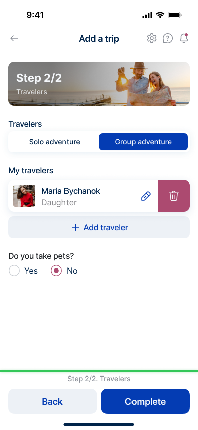

### Add a trip (1:29302)

[Open in Figma](https://www.figma.com/design/FVVplMUExRWDAY1npMxRmj/Check2Go?node-id=1-29302)

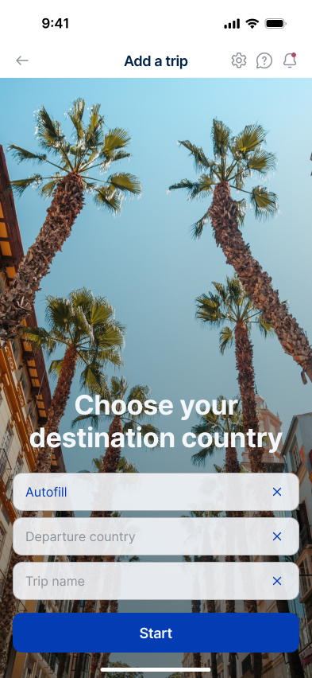

### Add a trip (1:29314)

[Open in Figma](https://www.figma.com/design/FVVplMUExRWDAY1npMxRmj/Check2Go?node-id=1-29314)

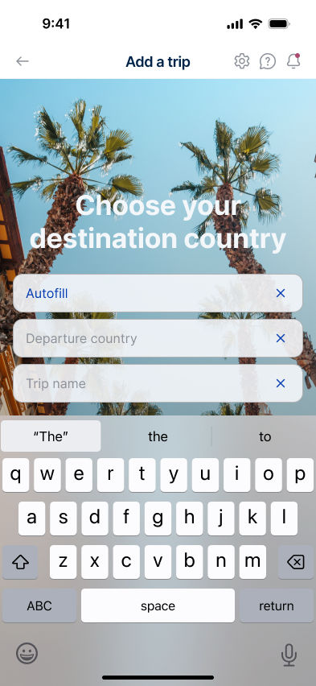

### Add a trip (1:29326)

[Open in Figma](https://www.figma.com/design/FVVplMUExRWDAY1npMxRmj/Check2Go?node-id=1-29326)

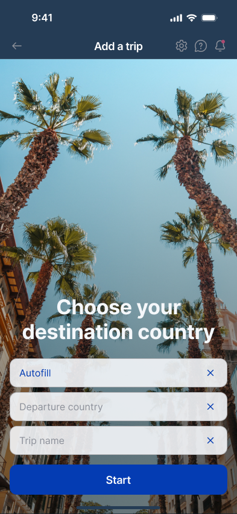

### Main screen-sheet trips (1:29340)

[Open in Figma](https://www.figma.com/design/FVVplMUExRWDAY1npMxRmj/Check2Go?node-id=1-29340)

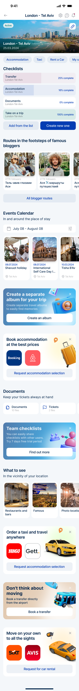

### Main screen-sheet trips (1:29482)

[Open in Figma](https://www.figma.com/design/FVVplMUExRWDAY1npMxRmj/Check2Go?node-id=1-29482)

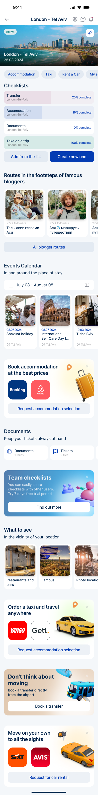

### Main screen-sheet trips (1:29624)

[Open in Figma](https://www.figma.com/design/FVVplMUExRWDAY1npMxRmj/Check2Go?node-id=1-29624)

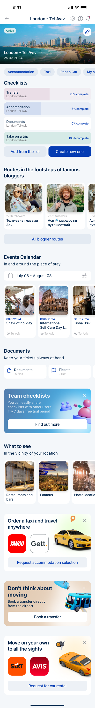

### Main screen-sheet trips (1:29766)

[Open in Figma](https://www.figma.com/design/FVVplMUExRWDAY1npMxRmj/Check2Go?node-id=1-29766)

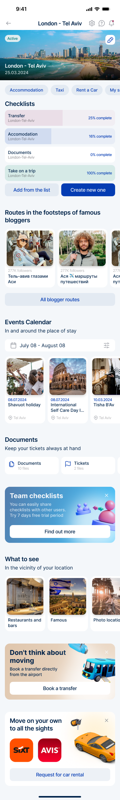

### Use hecklist-Take on a trip (1:29908)

[Open in Figma](https://www.figma.com/design/FVVplMUExRWDAY1npMxRmj/Check2Go?node-id=1-29908)

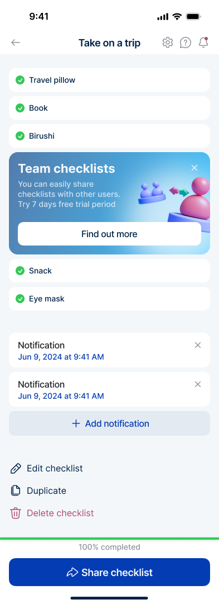

### Use hecklist-Transfer (1:29943)

[Open in Figma](https://www.figma.com/design/FVVplMUExRWDAY1npMxRmj/Check2Go?node-id=1-29943)

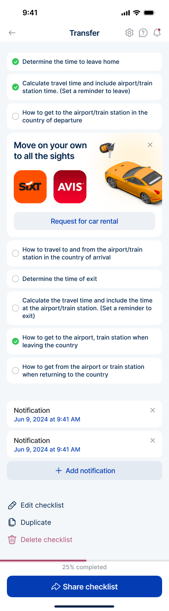

### Use hecklist-Accommodation (1:29981)

[Open in Figma](https://www.figma.com/design/FVVplMUExRWDAY1npMxRmj/Check2Go?node-id=1-29981)

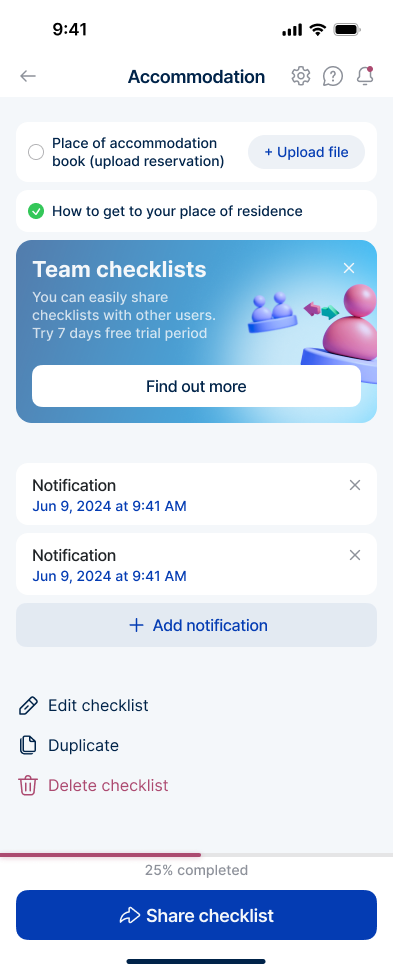

### Create checklist (1:30013)

[Open in Figma](https://www.figma.com/design/FVVplMUExRWDAY1npMxRmj/Check2Go?node-id=1-30013)

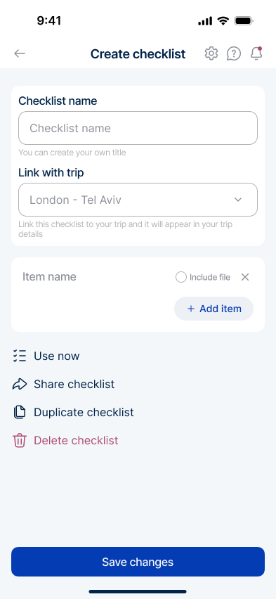
